# OnstepEspLoader

This is a Python application designed to upload
- firmware.bin binary file to STM32 over serial bootloader - use #serialScript.py for this
- SmartWebServer.ino.bin binary file to ESP8266

## Features
- Check presence of STM32 bootloader by get part ID
- Flash STM32 in serial bootloader
- Check presence of OnStepX
- Switch STM32 to transparent serial port by sending :hF#:ESPFLASH# to OnStep at 9600 baud to enable SWS upload mode.
- Flash ESP with SmartWebServer

## Requirements
- Python 3.7+
- pip

## Setup
1. Install dependencies:
   ```sh
   pip install stm32loader
   pip install pyserial
   ```
2. Connect your STM32/ESP32 device via USB.
3. Run the application:
   ```sh
   python main.py
   ```

## Usage
- Follow the buttons - they are self explanatory
- The script will handle the upload process.

## License
MIT

---

## 🖼️ Photo Gallery

<div align="center">
  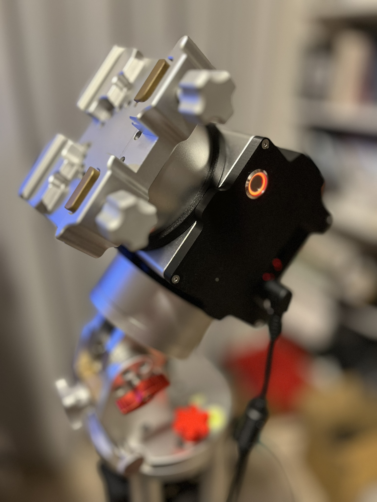
</div>

<div align="center">
  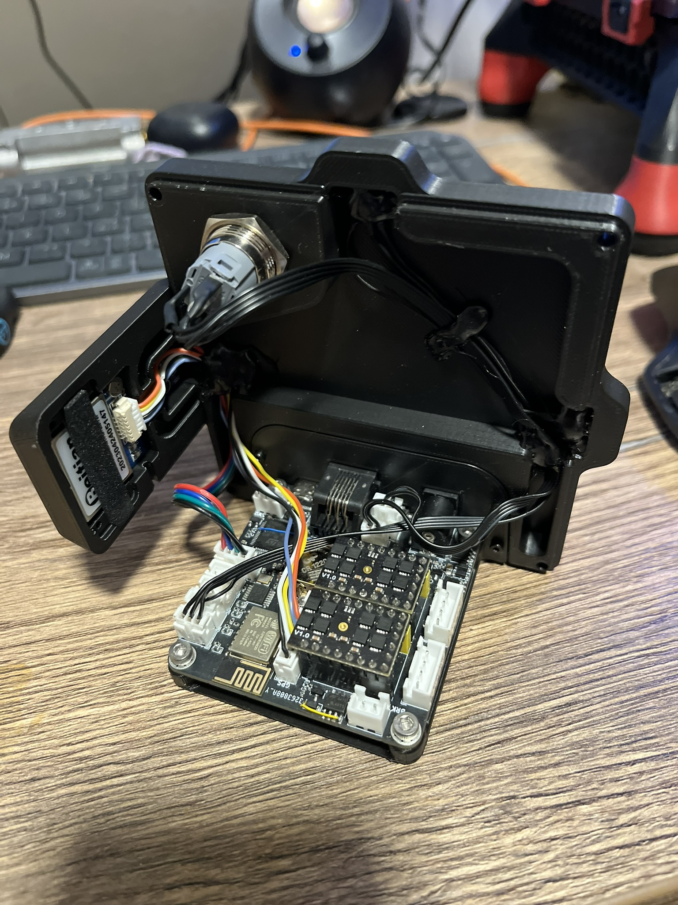
  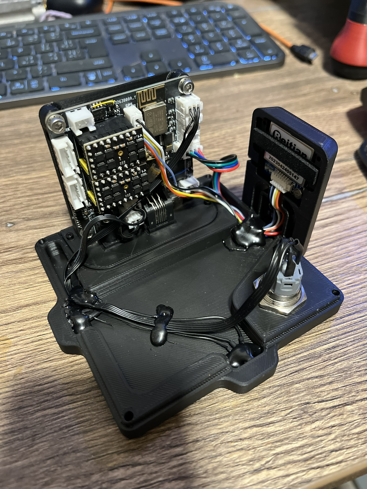
</div>
<div align="center">
  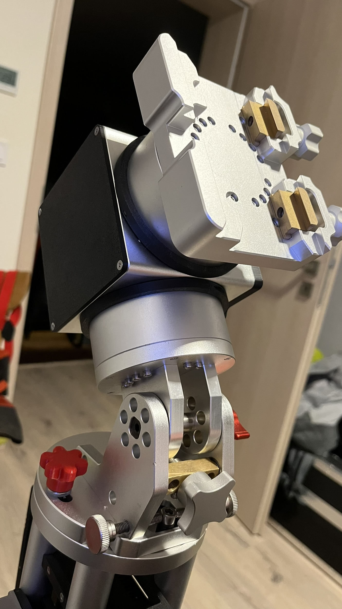
  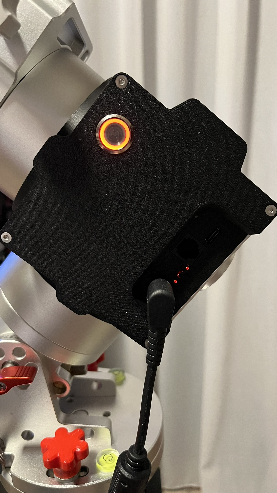
</div>
<div align="center">
  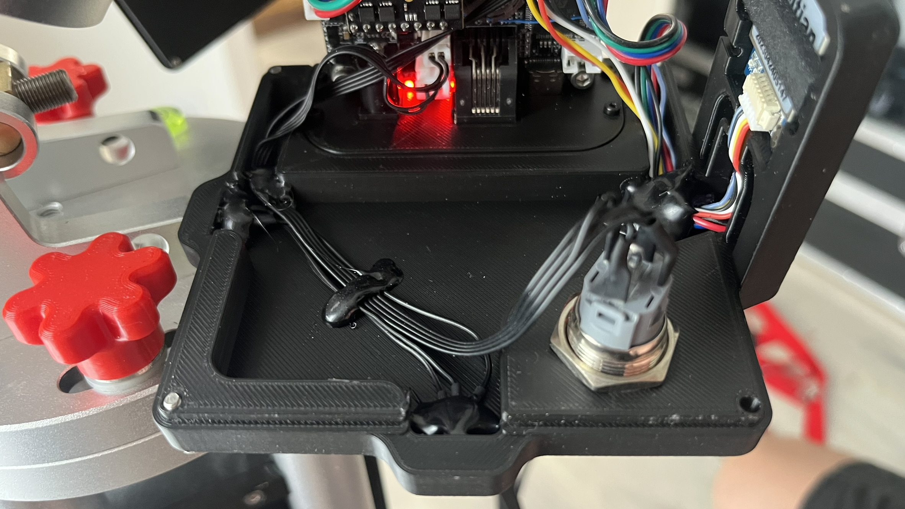
  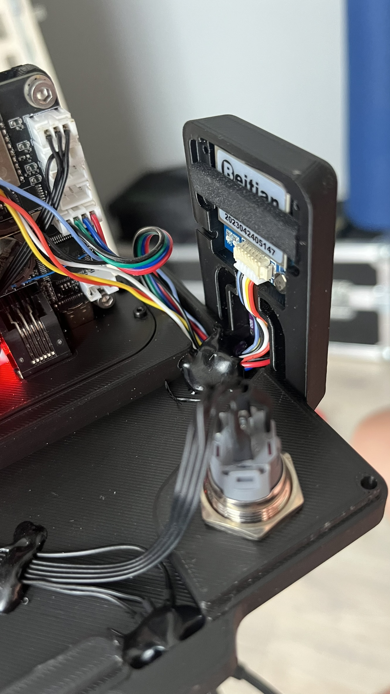
</div>
<div align="center">
  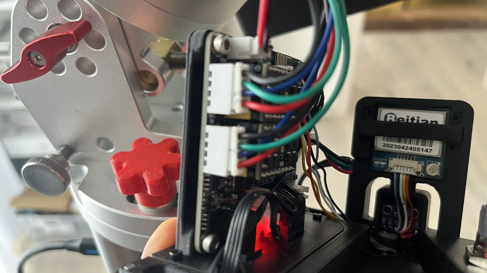
  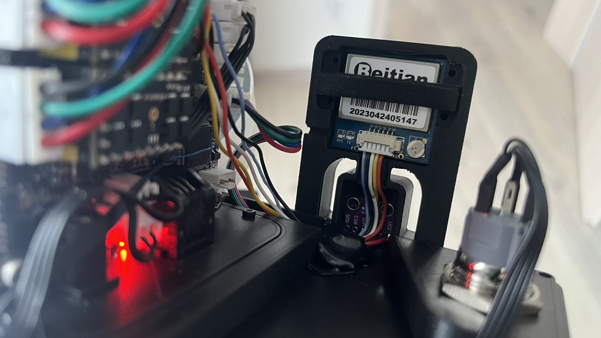
</div>
<div align="center">
  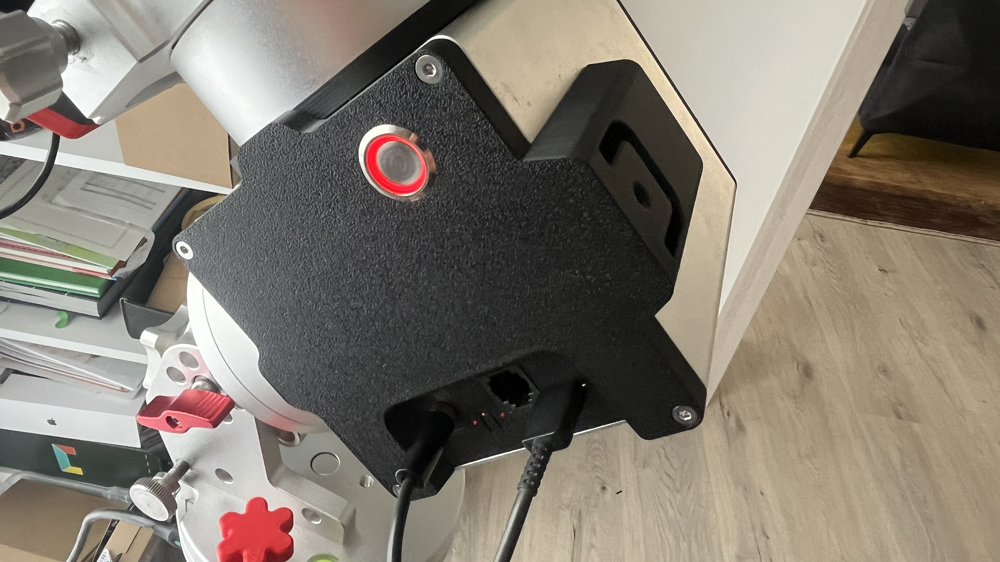
  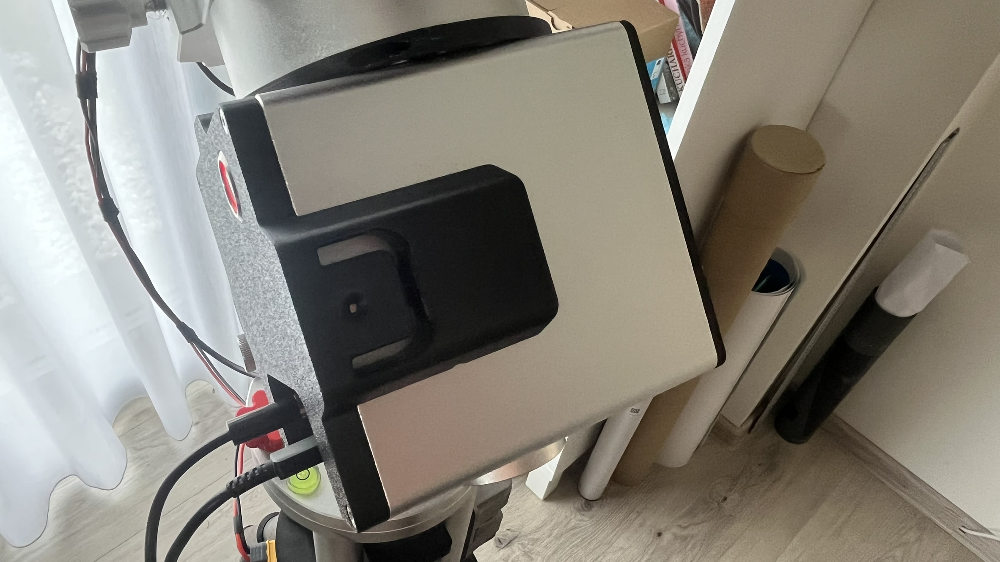
</div>
<div align="center">
  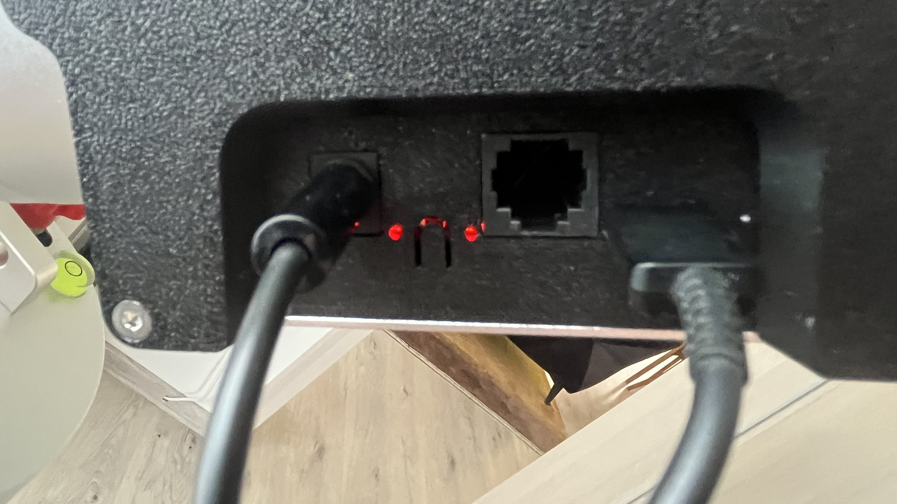
  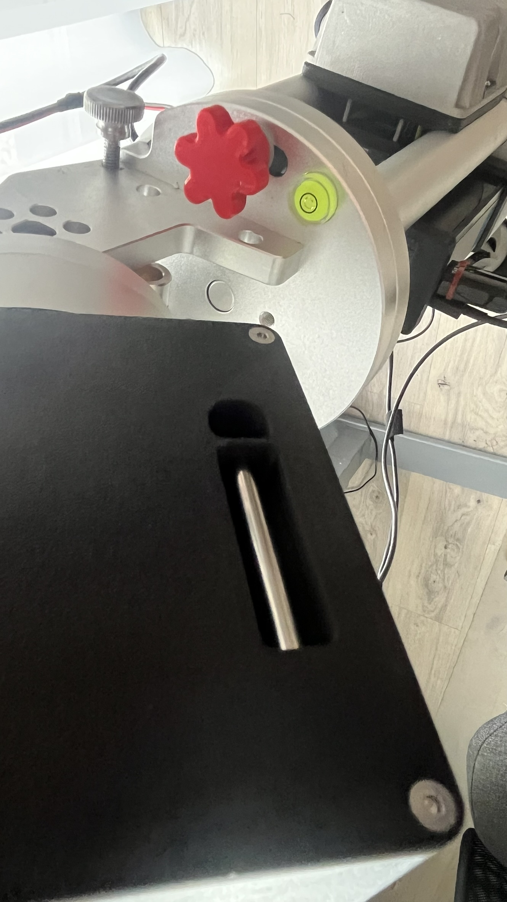
</div>
