

  <h1>Juwei17 Mount Upgrade</h1>
  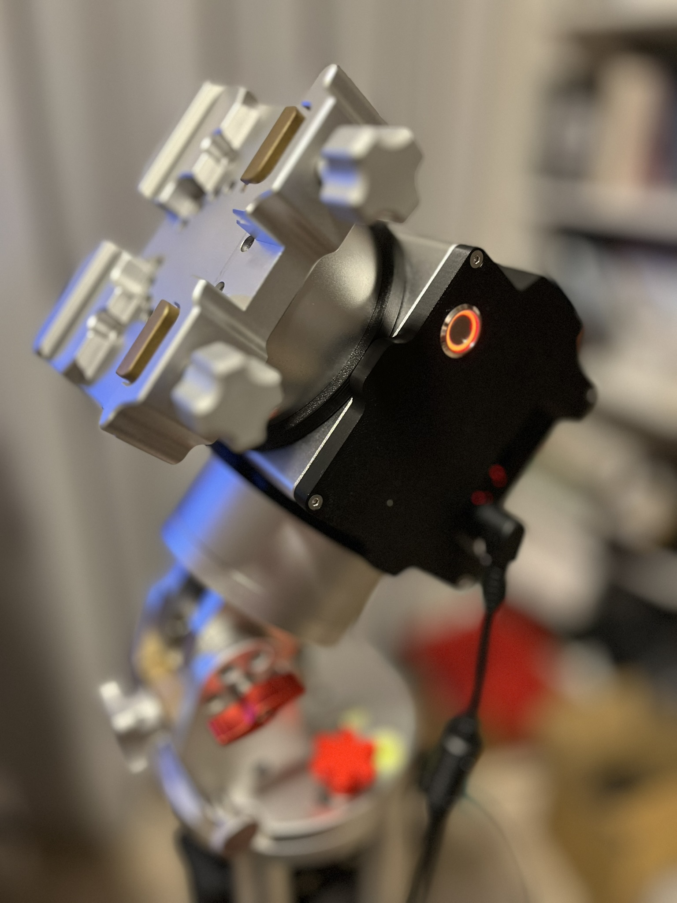

## 🚀 Project Overview

This repository contains subprojects to upgrade the Juwei17 mount with enhanced hardware, software, and mechanics. The goal is to provide a modern, feature-rich, and user-friendly experience for astronomy enthusiasts.

---

## 🧑‍🔧 Skills Needed

 - Project is very DIY oriented
 - PCB is very dense and it is recommended to manufacture it via some service (JLCPCB or similar)
 - Some soldering (hall sensors, BME280, switch, connector crimping)

## ✨ Upgrade Features

- **Larger on/off switch**
- **Homing**
- **GPS**
- **Weather sensors**
- **Fast slewing possible**
- **Support for TMC SPI or UART modules**  
  (TMC2209, TMC2130, TMC5160, etc.)
- **USB-C connector**
- **Programming button** (no ST-Link needed)
- **Loader application** (semi-automatic programming for OnStep and SWS)

---

## 🧩 Hardware Features

- Minimized PCB size
- Support for Home and Limit switches
- OnWire interface
- GPS interface
- STM32F446 as main processor
- Power switch not needed:
  - No high current goes through switch itself
  - When switch is closed, mount is off

---

## 💾 Software Features

- Based on OnStepX (preconfigured, just upload)
- Added STM32 RTC support
- Modified Weather:
  - Due to excessive BME self-heating
  - Temperature from DS1820
  - Humidity and pressure from BME280
- TLS fallback (STM32 → GPS)

---

## 🏗️ Mechanics

- CAD files
- STL files for 3D printing new covers

---

## 📦 Required Components

- New hardware - data on this github repo
- 2x TMC Drivers - you can reuse TMC2209 from your orignal main board
  - TMC2209 UART - [link](https://www.aliexpress.com/item/33028050145.html)
  - TMC2130 SPI - [link](https://www.aliexpress.com/item/32970150483.html)
  - TMC5160 SPI - [link](https://www.aliexpress.com/item/1005006043696147.html)
- Beitian BK-280 GPS module -  [link](https://www.aliexpress.com/item/1005009032383874.html)
- BME280 module - [link](https://www.aliexpress.com/item/1005007070789246.html)
- DS1820 - [link](https://www.aliexpress.com/item/1005009032259334.html)
- 2× 3144 hall sensors for homing functionality [link](https://www.aliexpress.com/item/1005008305500149.html)
- 16mm antivandal switch - 16mm, 12-24V, latching - [link](https://www.aliexpress.com/item/1005007144363231.html)
- Wires, connectors, hot glue, etc.
- Crimping plyers (Iwiss IWS-2820M)
- Magnetic rings:
  - Magnets 20×5×2mm [link](https://www.aliexpress.com/item/1005009668801201.html)
    ⚠️ *Warning: Large deviation in sizes experienced!*
- Screws M2×6 Voron style self-tapping screws - [link](https://www.aliexpress.com/item/1005003604942716.html)
- 4x M3x16, 4x  M3x10 countersunk
- optional 3144 hall sensor module for test [link](https://www.aliexpress.com/item/1005009110720818.html)
 - 5V power
 - It can help you to check polarity and sensitivity for you DIY magnet rings

---

## 🛠️ Building Tips

- Use hot glue to fix hall sensors and wires
- Mind the hall sensor "polarity" and magnets orientation in rings - good to check with dry run before mounting everything together

---

## 📁 Folder Description

- **CAD**: SolidEdge models (`*.par` files)
- **HW**: KiCad files (design and schematic PDF)
- **Images**: Build images
- **OnstepEspLoader**: Python app to support you through flashing process
- **OnStepX**: OnStep code (PlatformIO and VSCode)
- **SmartWebServer**: ESP8266 code (built in Arduino due to specific Espressif version)
- **STLs**: Files for 3D printing

---

## 📝 ToDo

- PEC

## 🖼️ Photo Gallery

    

    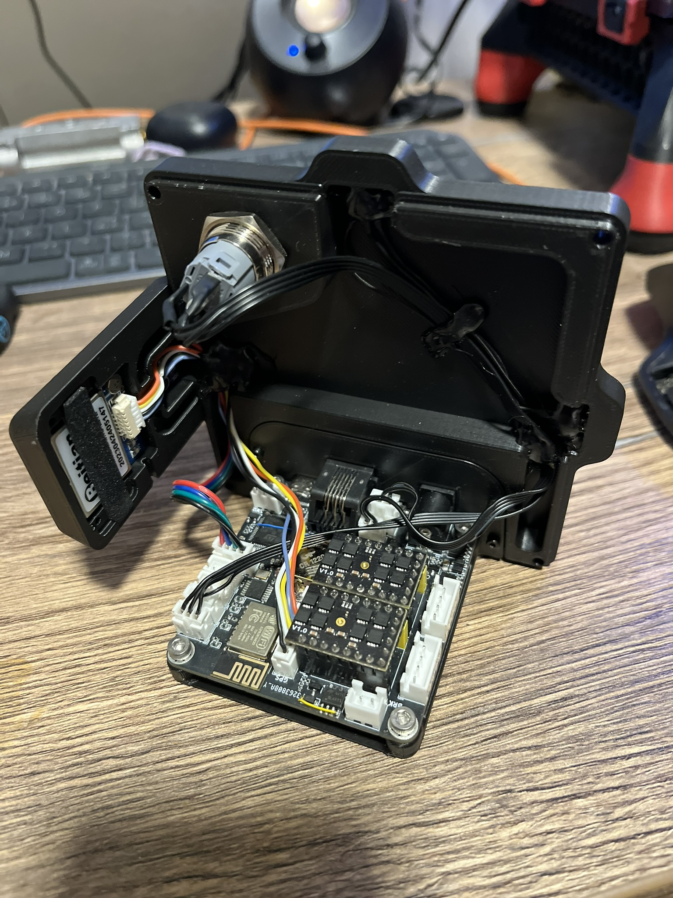
    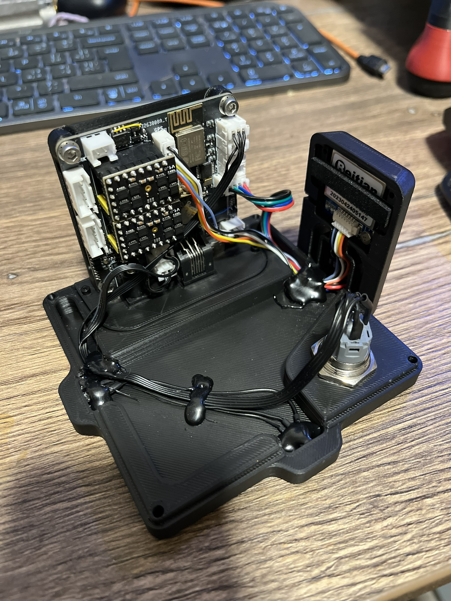

    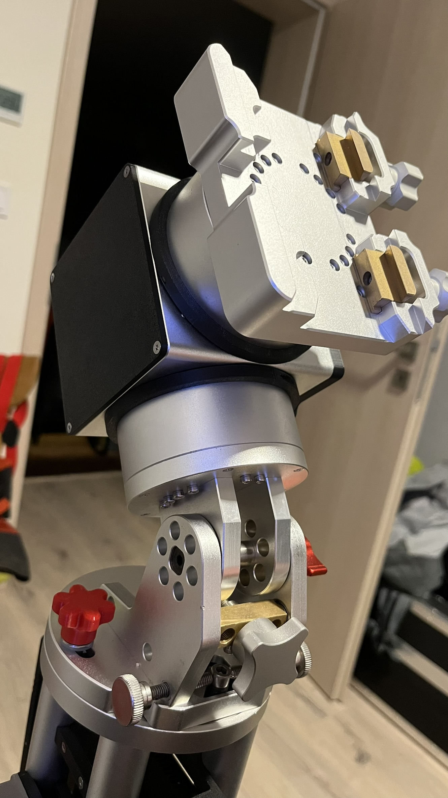
    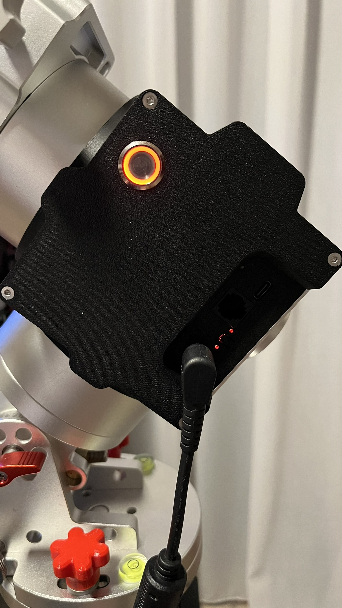

    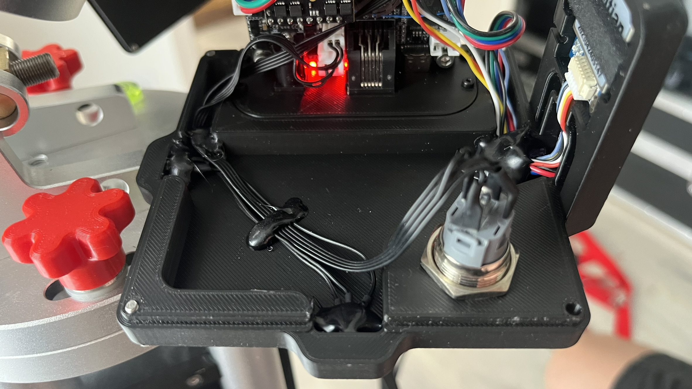
    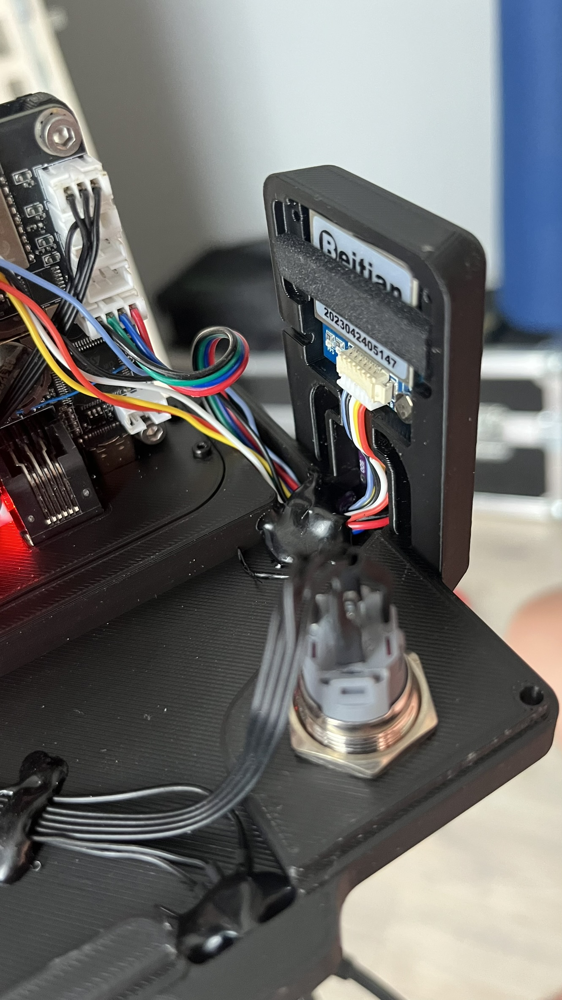

    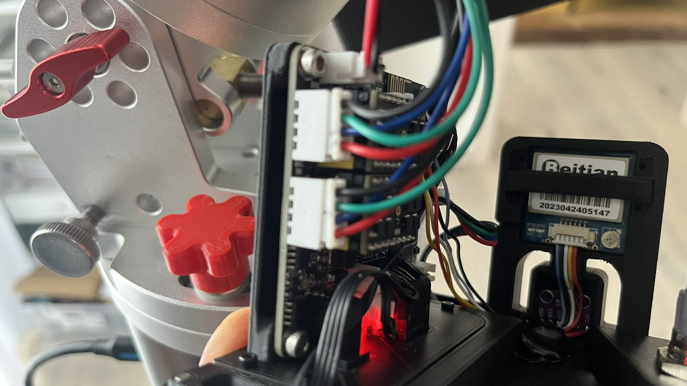
    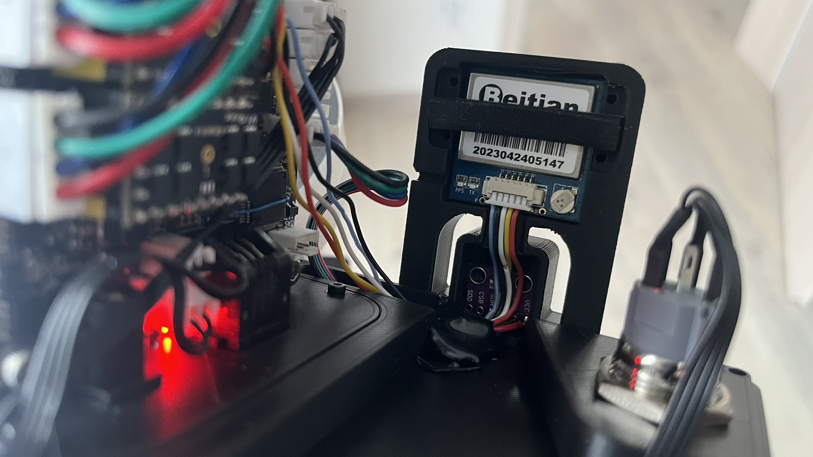

    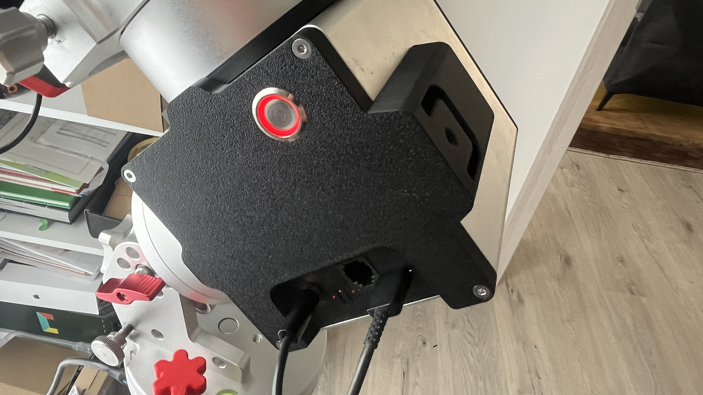
    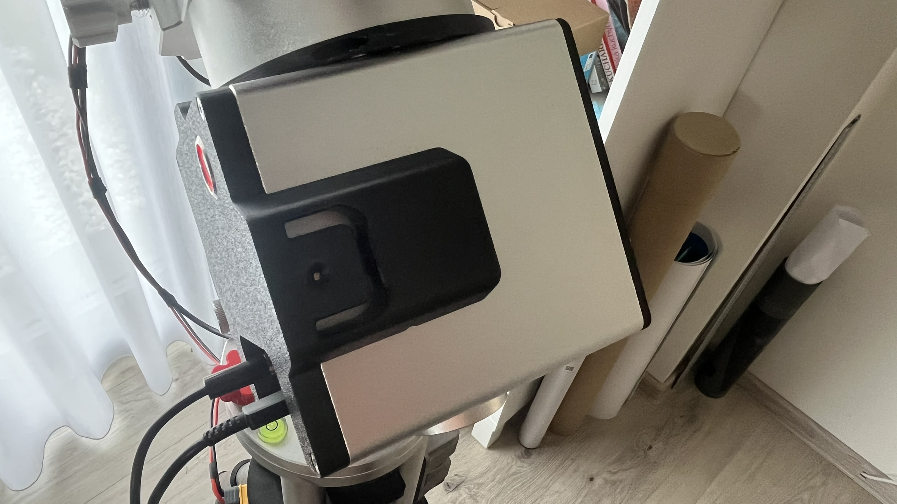

    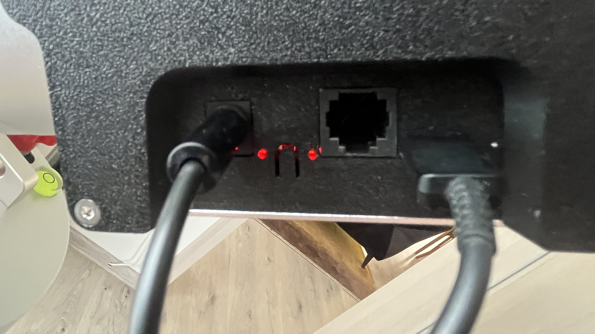
    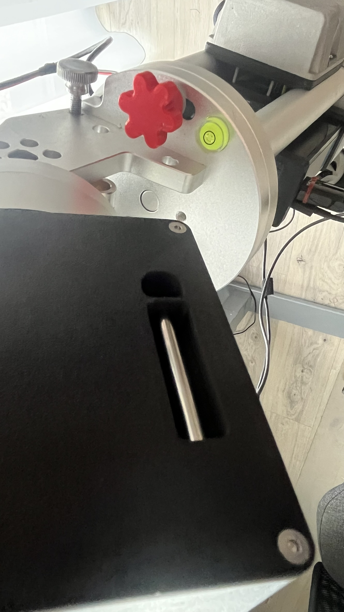

## 🛠️ Assembly Instructions

1. **Print the required parts.**
2. **Prepare magnets for the magnet rings:**
    - Ensure all magnets are oriented in the same direction.
    - Take care to prevent magnets from snapping together unexpectedly.
    - Test magnet polarity using a 3144 module or a bare sensor.
3. **Insert magnets into the rings.**
    - Fill roughly 90-180degrees
4. **Secure magnets with a thin layer of epoxy.**
    - 5min epoxy is ideal
5. **Assemble the front cover using small screws.**
    - Put together PCB_holder and front_panel
6. **Install hall sensors and wiring into the new cover.**
    - Insert hall sensor with right orientation (double check)
    - Fix them in place with hotglue
7. **Mount the new 16mm switch and do wiring.**
    - We use NO contact for mount ON, NC contact for mount OFF
    - Switch backlight is connected to maiboard
8. **Prepare and install wiring for the GPS and BME280 modules.**
    - Solder longer wires and cut them later to perfect lenght for BME280
    - For GPS just cut the wire to perfect lenght
    - Install modules in cavities
    - Fix GPS with GPS_holder and small screws
9. **Install the DS1820 sensor in the second cover.**
    - Pressfit the sensor in place
    - Cut wires to size
10. **Secure all wires with hot glue.**
    - Aim is to not have wire getting pinched during cover installation
11. **Trim wires to length and crimp connectors.**
12. **Plug in jumper for UART/SPI TMC**
13. **Insert TMC modules**
14. **PCB installation**
    - Reuse brass standoff - insert them into holes in front cover
    - Attach the PCB on these standoff    
15. **Connect all components together.**
    - Install back cover
    - Plug in all connectors
    - Install front cover
    - Screw in four screws for PCB from the botton of the mount
16. **Assembly complete!**

## 💻 Firmware Upload

1. **Power off the device.**
2. **Press and hold the button** next to the power connector.
3. **Power on the device.**
4. **Observe the LEDs:**
    - OnStep status LED will be off.
    - WiFi LED will blink if firmware is present; if the ESP is empty, both LEDs will be off.
5. **Start the OnstepEspLoader Python app.**
6. **Select the correct TMC module type.**
7. **Choose whether to enable homing** (can be disabled if needed).
8. **Click "Check STM32":**
    - The bootloader should respond.
    - If it fails, click again.
9. **Click "Upload STM32":**
    - Firmware upload will start.
10. **Wait for the OnStep status LED:**
    - It should turn on after some time.
    - The first boot may take longer as EEPROM is being formatted.
11. **Click "Check OnStep":**
    - It should respond with name and version.
12. **Switch to SWS mode:**
    - OnStep enters transparent mode and is ready to upload ESP firmware.
13. **Click "Upload ESP":**
    - Firmware for the webserver will be uploaded to the ESP.
14. **Finish:**
    - A soft reset will occur after some time, or you can power cycle the device manually.

## ⚙️ Default Firmware Configuration

Firmmare configuration expects
- BME280, DS1820 - if initialization fails, ther will be no weather inforation on webserver
- TMC2209, TMC5160 or TMC2130 - according to selected firmware during programming
- Correct polarity of HAL sensors for homing - if not fullfiled, homing will not work correctly
- Current is set to 1.0A for RUN and 1.3 for GOTO
- Homing sense is HIGH

## 🏗️ Build Your Own OnStepX

- If you use OnStepX from Howard Dutton - there will be no support for STM32 RTC (time and date will not be stored) and weather service will provide false temperatures from BME280 (selfheating)
 - This could be potentially merged into main branch (I know that STM32 RTC was not planned - there are no official boards ready for this, weather fix is open)
- For Juwei17 board use the OnStepX from this repository
- Change configuration as needed
- For upload user Serial Bootloader - depending on your IDE how to do it 
- There are three pads on the botton of the PCB to connec to ST-Link - you need to solder wires or connector with 2mm pitch
- If you want to use OnstepEspLoader app copy to app folder and rename the binary file according to you this pattern:

| Firmware Name         | TMC Module | Homing      |
|-----------------------|------------|-------------|
| firmware_5160_wH      | TMC5160    | With Homing |
| firmware_5160_woH     | TMC5160    | Without Homing |
| firmware_2130_wH      | TMC2130    | With Homing |
| firmware_2130_woH     | TMC2130    | Without Homing |
| firmware_2209_wH      | TMC2209    | With Homing |
| firmware_2209_woH     | TMC2209    | Without Homing |

